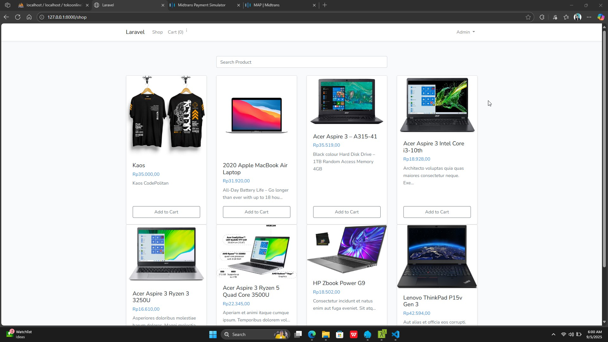
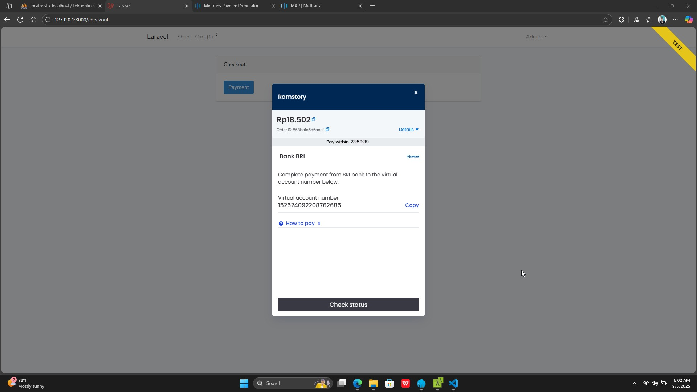

<p align="center">
  
</p>

<p align="center">
  <a href="https://travis-ci.org/laravel/framework"></a>
  <a href="https://packagist.org/packages/laravel/framework"></a>
  <a href="https://packagist.org/packages/laravel/framework"></a>
  <a href="https://packagist.org/packages/laravel/framework"></a>
  
  

</p>

---

## About Laravel

Laravel is a web application framework with expressive, elegant syntax. ...

## Table of Contents

-   [About Laravel](#about-laravel)
-   [Learning Laravel](#learning-laravel)
-   [Sponsors](#laravel-sponsors)
-   [Contributing](#contributing)
-   [License](#license)

## Quick Start

```bash
git clone https://github.com/username/project.git
cd project
composer install
php artisan serve
```

---

### **7. Tambahkan License dan Contact di Bagian Bawah**

Letakkan **MIT License** dengan link dan kontak pengembang agar jelas.

---

Mau saya **rapikan semua isi README kamu di atas jadi versi clean & profesional (sesuai best practice GitHub)**?  
Kalau iya, kamu mau versi **minimalis (simple)** atau **full (dengan TOC, Quick Start, Contributing, Sponsors)**?
